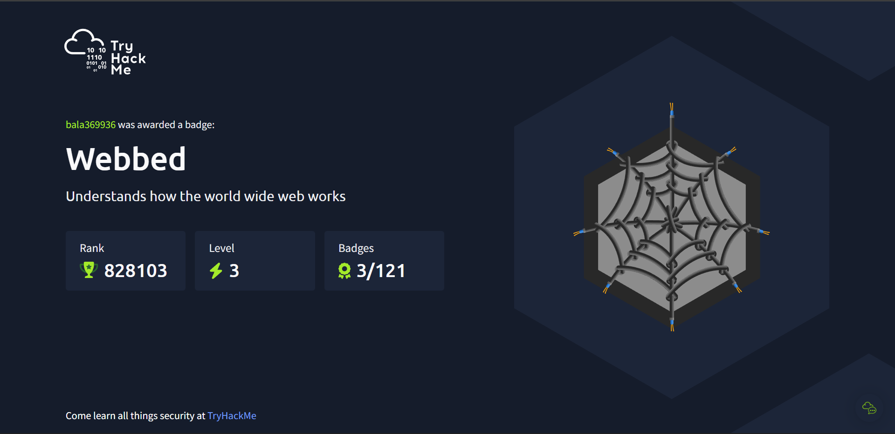

# tryhackme-ctf-

# 🛡️ TryHackMe Cybersecurity Learning Project

## 📌 Overview
This repository shows my hands-on cybersecurity learning using the TryHackMe platform.  
It includes practical exposure to networking, Linux, and security fundamentals through guided labs.

---

## 🎯 Objective
- Learn cybersecurity basics
- Practice networking and Linux
- Build a professional learning portfolio

---

## 🧠 Skills Learned
- OSI Model
- Linux Basics
- DNS & nslookup
- Networking fundamentals
- Information gathering

---

## 🛠️ Platform Used
- TryHackMe
- Linux Terminal

---

## 📸 Proof of Work

### 🏅 TryHackMe Badge

### ✅ Room Completion

---

## 👤 Author
**Balamurugan**  
B.Tech CSE (Cybersecurity)

---

- 📄 [nslookup Tool Documentation](recon-tools/nslookup.md)

## ⚠️ Disclaimer
This project is for educational purposes only.
